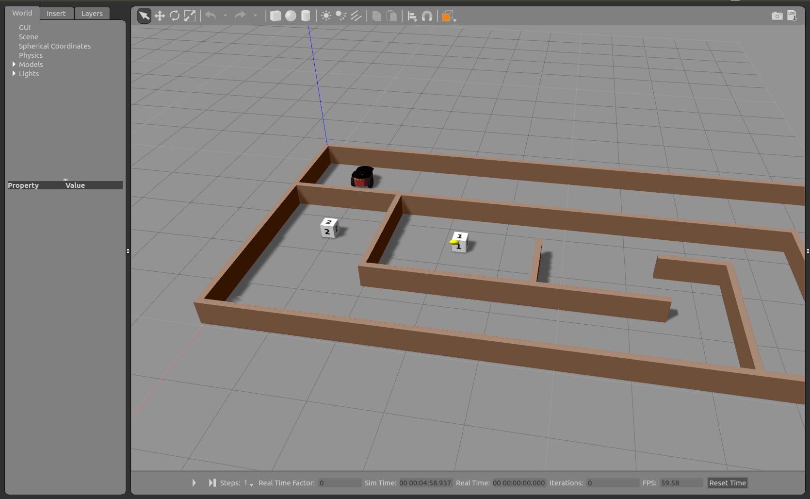
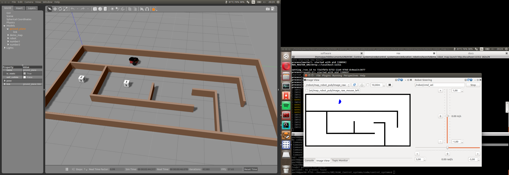

Navigation tutorials
====================

This section contains some tasks related with robot navigation and strategies for obstacle avoidance.

Reach the goal!
^^^^^^^^^^^^^^^

We have prepared for you a maze that includes robot, some goal positions and a closed map.

Your task is simple: Move the robot through the maze and reach the goals number 1 and 2 as faster as possible.

You can start the program by running:

.. code-block:: none

    cd ~/catkin_ws
    source devel/setup.bash
    roslaunch education_robotics tutorials_navigation.launch

In the same way as before, you can edit a template located at: **education_robotics/src/tutorials/2_navigation.py**

- You should get something like this:

Map and odometry: obstacle avoidance
^^^^^^^^^^^^^^^^^^^^^^^^^^^^^^^^^^^^

Once you have succeeded with the previous task, you are ready for increasing the complexity of next task:

Now, you should create an algorithm that allows the robot to avoid obstacles and explore the map until reaches goals number 1 and 2.

In order to do that, you can use robot odometry and map for making predictions about coming obstacles.

A simple template is available on: **education_robotics/src/tutorials/3_obstacle_avoidance.py**

This script subscribes for odometry and map information, and allows you to estimate the coming obstacles based on current robot position and fixed map.

Let's have a look at part of script:

- Create a callback for map subscriber, the map is represented as an image and after processing is saved into global variable (self.map)

.. code-block:: none

    # Update map
    def callback_map(self, data):
        try:
            temp_map = self.bridge.imgmsg_to_cv2(data, "bgr8")

            # convert into gray scale
            (rows, cols, channels) = temp_map.shape
            if cols > 0 and rows > 0 :
                self.map = cv2.cvtColor(temp_map,cv2.COLOR_RGB2GRAY)

        except CvBridgeError as e:
            print(e)

- Subscribe for odometry information and save it into global variables.

.. code-block:: none

    # update position and orientation of robot (odometry)
    def process_odometry_message(self, odometry_msg):
        self.robot_position_x = odometry_msg.pose.pose.position.x
        self.robot_position_y = odometry_msg.pose.pose.position.y
        self.robot_orientation = odometry_msg.pose.pose.orientation.y

        quaternion = (
            odometry_msg.pose.pose.orientation.x,
            odometry_msg.pose.pose.orientation.y,
            odometry_msg.pose.pose.orientation.z,
            odometry_msg.pose.pose.orientation.w)

        (self.robot_roll, self.robot_pitch, self.robot_yaw) = euler_from_quaternion(quaternion)

- Take into account that odometry is given in meters and the map is given in pixels, the relationship between them is:

1 meter = 100 pixels

- This part does a basic obstacle detection, it considers a "safety boundary region" around the robot and a loop detect any obstacle inside this area.

.. code-block:: none

    # define a safety boundary region around robot
    boundary = 40
    detected_obstacle = False

    # loop inside boundary, check if there are obstacles
    for y in range( int((self.robot_position_y*100) - boundary), int((self.robot_position_y*100) + boundary) ):
        for x in range( int((self.robot_position_x*100) - boundary), int((self.robot_position_x*100) + boundary) ):
            map_point = self.map[x, y]
            if map_point < 1:
                # Obstacle detected!
                detected_obstacle = True

                # Here design your own routine for obstacle avoidance and navigation!

                # for logging: visualize using console plugin in rqt.
                # rospy.loginfo("close to obstacle y %f  x %f p %f", y , x, map_point)

                break

- Once you have modified the source code (python script), you can test it by running:

.. code-block:: none

    cd ~/catkin_ws
    source devel/setup.bash
    roslaunch education_robotics tutorials_obstacle_avoidance.launch

- You should have something like this: Gazebo simulator with robot and map + RQT interface with tools.

