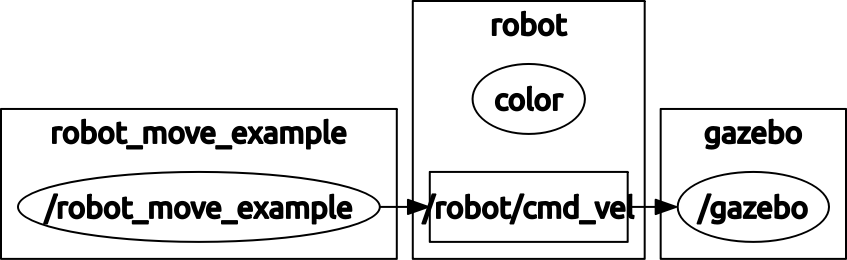
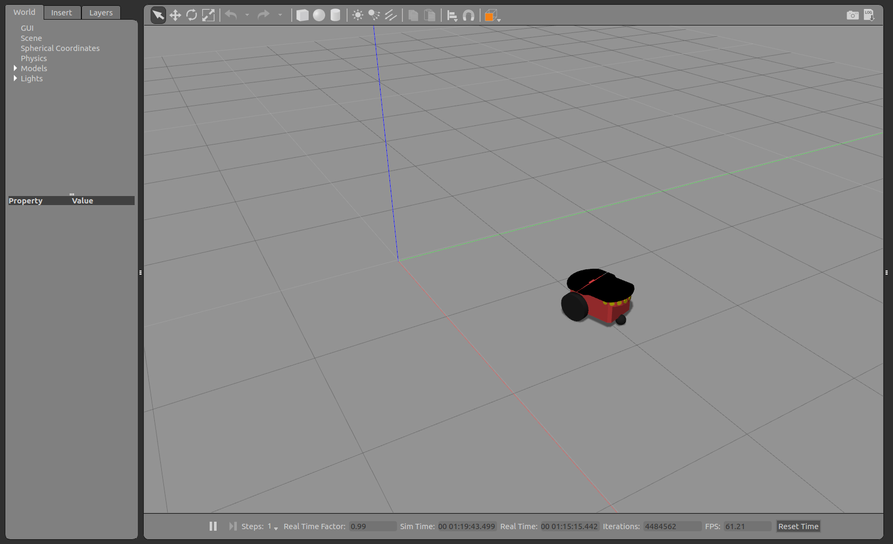

Introduction tutorials
======================

This section present some examples of how to use gazebo simulator and ROS in order to play
with the robot and develop some extensions.

This tutorials assume you have already installed and tested project, see installation page for more details.

Getting started
^^^^^^^^^^^^^^^

The demo (demo_robot_simple.launch) that you have tested in previous section shows a simple example of how ROS interface with gazebo.

This demo is composed by the following nodes (processes):

- **robot_move_example:** A python scripts that send command velocities for robot (/robot/cmd_vel), placed on: education_robotics/src/robot_move_example.py

- **gazebo:** shows and moves the robot

Node graph of simple demo:

Let's have a look at some parts of **robot_move_example.py** script:

- The first part of the code creates a new ROS node, a publisher that send command velocities to the robot (self.cmd_vel_pub) and define the update speed (self.rate)

.. code-block:: none

    # Init ros node
    rospy.init_node('robot_cmd_vel')

    # create a publisher for command velocity
    self.cmd_vel_pub = rospy.Publisher('/robot/cmd_vel', Twist, queue_size=1)

    # define rate of transmission: 10 hz
    self.rate = rospy.Rate(10.0)

- Now we create a infinity loop that sends commands to robot using some methods:

.. code-block:: none

    while not rospy.is_shutdown():

    self.move_forward()
    time.sleep(3)

    self.rotate_left()
    time.sleep(2)

    self.stop_robot()
    time.sleep(1)
    .......

- If we take a look at one of this methods, we can realize that it only changes velocities for linear and angular components, in this case (move_forward), it defines linear component equals to 0.3 and angular = 0 (no rotation):

.. code-block:: none

    # move forward robot
    def move_forward(self):
        # create Twist message
        cmd = Twist()
        cmd.linear.x = 0.3
        cmd.angular.z = 0.0

        # Send command
        self.cmd_vel_pub.publish(cmd)

You can use this script as a template for new programs in the future.

First task: Make some figures with the robot!
^^^^^^^^^^^^^^^^^^^^^^^^^^^^^^^^^^^^^^^^^^^^^

You should program the movement of robot in order to perform some geometrical figures like circles, triangles, squares etc...

We have prepared for you a script with almost everything you need for this task, you can find the script at: **education_robotics/src/tutorials/1_basic_figures.py**

Please open the file an complete the missing parts:

.. code-block:: none

    # send commands at 10 hz
    while not rospy.is_shutdown():
        # ---------------------
        # Place your code here:
        # remember you should create a set of figures with the robot
        # if you have problems, you can use robot_move_example.py as a example.

        # circle:

        # triangle:

        # square:

        # others?:

        # ----------------------

Once you have modified the code, you can test it using the following commands:

.. code-block:: none

    cd ~/catkin_ws
    source devel/setup.bash
    roslaunch education_robotics tutorials_test_figures.launch

- You should have something like this:

Now you are ready for more challenging tasks, lets check the next section!